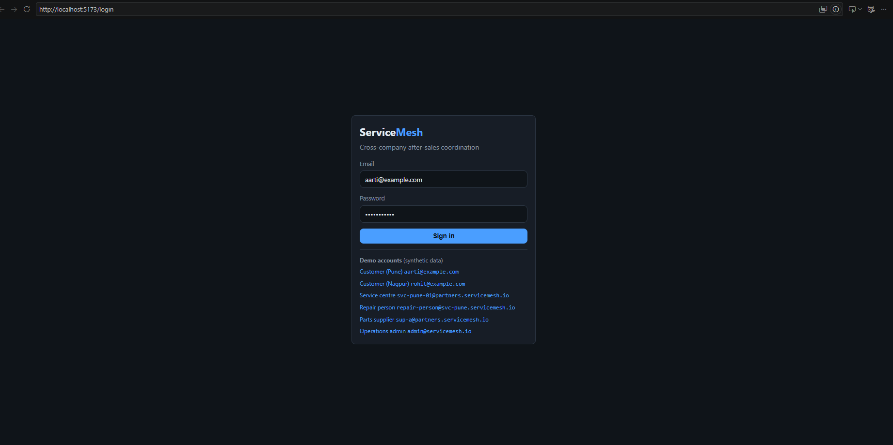
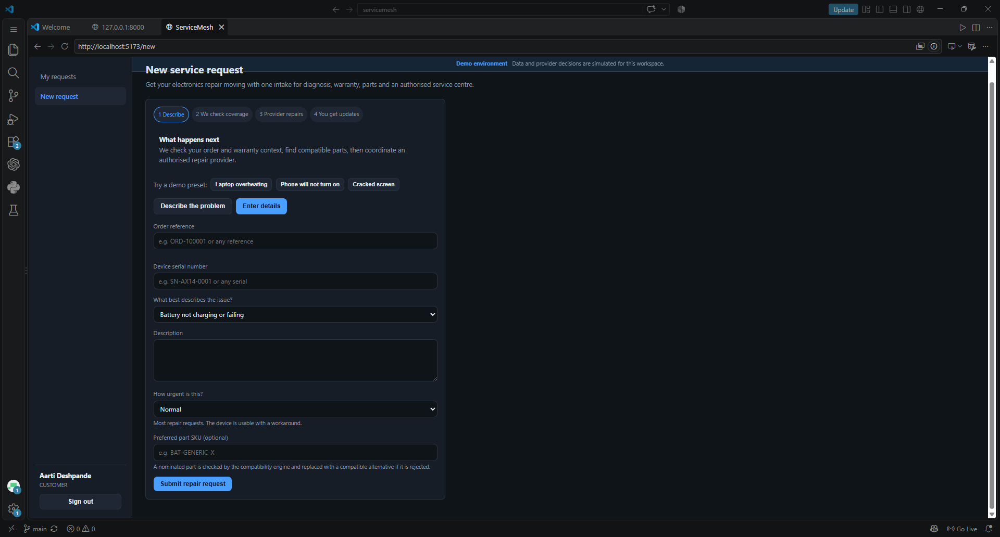
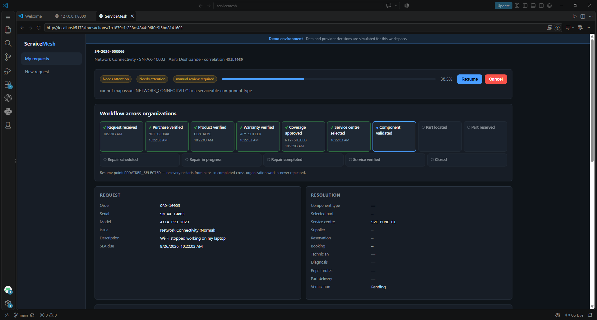
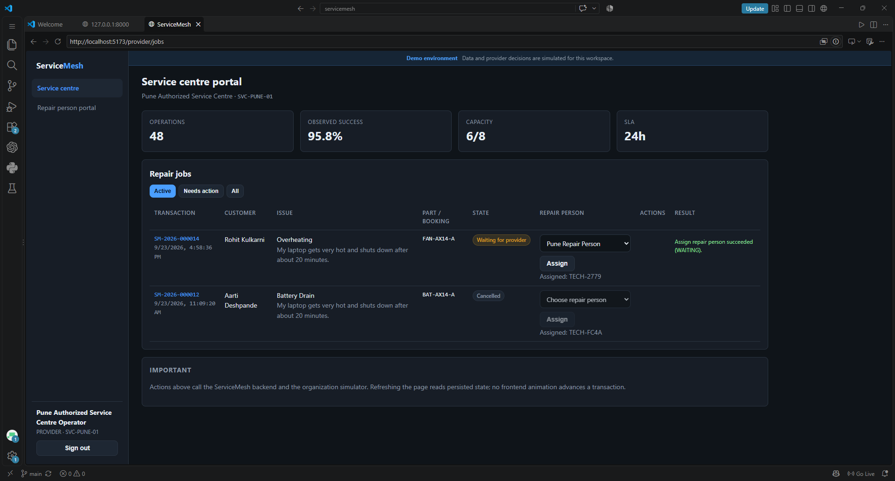
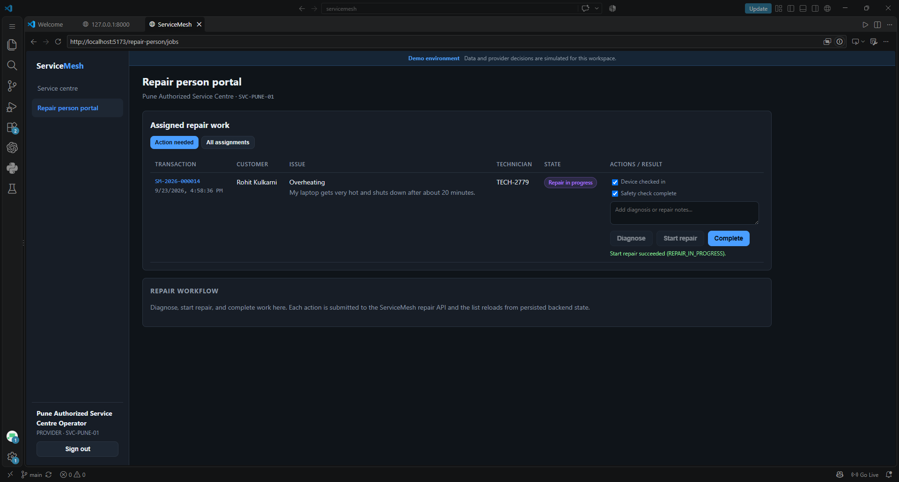
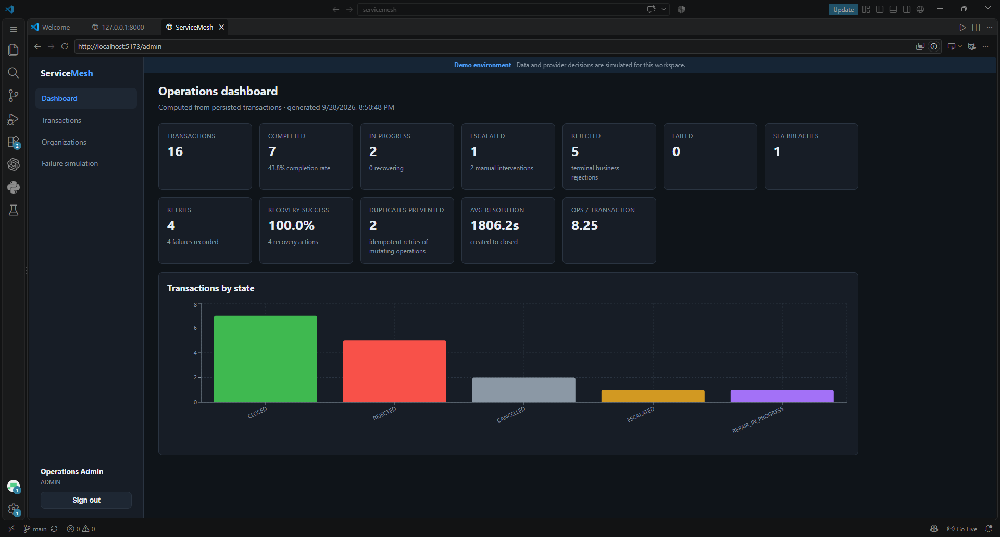
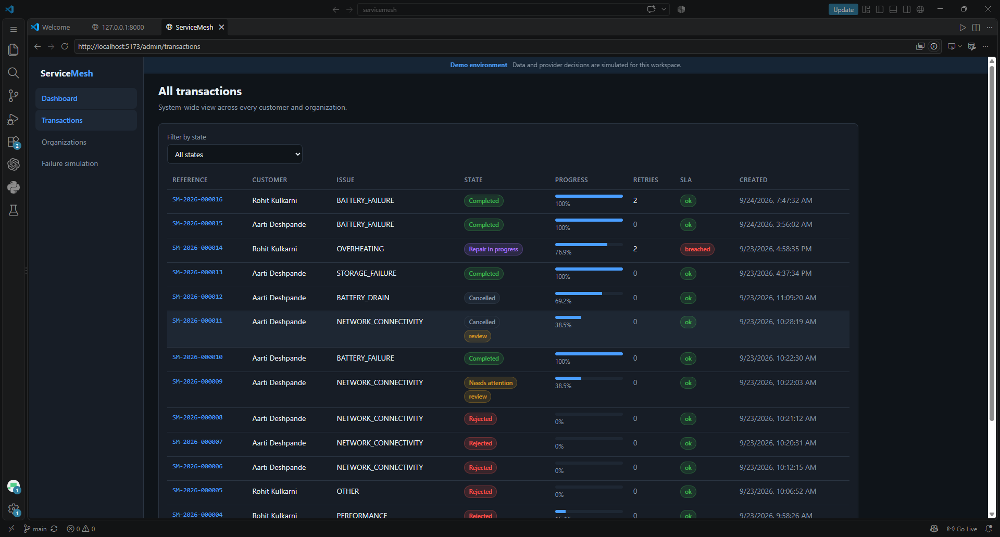
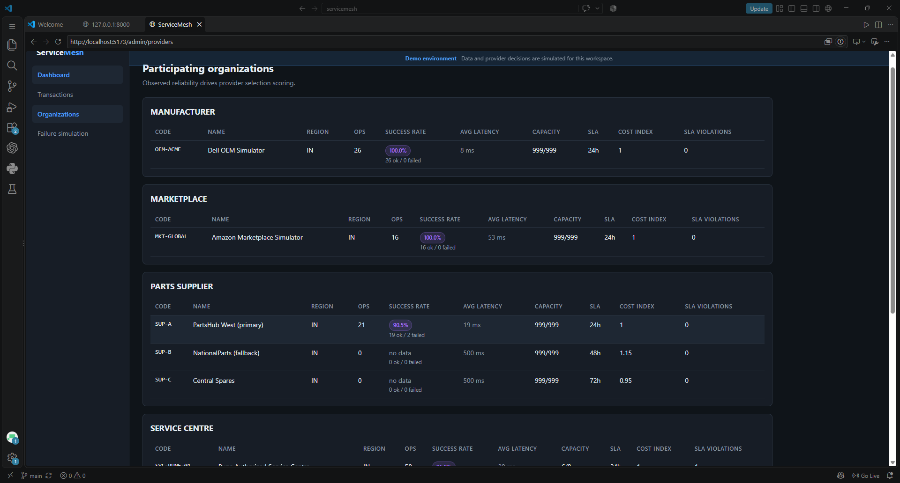
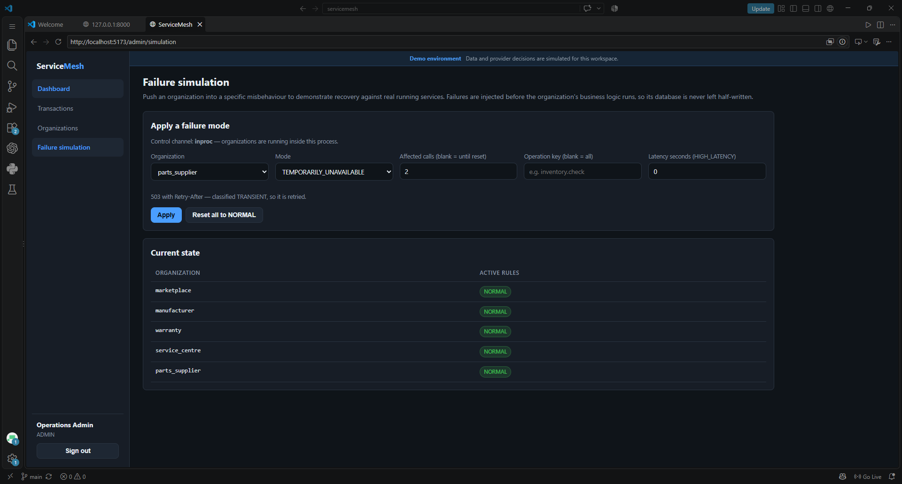

# ServiceMesh

### A Failure-Aware After-Sales Service Orchestration Platform

**Connecting customers, OEMs, warranty providers, authorized service centers, repair technicians, and parts suppliers through a coordinated service workflow.**

[View Source Code](https://github.com/Tejaswini-Wankhede/Servicemesh)

---

## 1. Overview

ServiceMesh is a student-developed prototype designed to address coordination and communication challenges in consumer-electronics after-sales service.

A typical repair request may involve multiple independent organizations. Customers can experience delays when warranty verification, service-center availability, technician assignment, spare-parts procurement, and repair confirmation are handled across disconnected systems.

ServiceMesh explores how these interactions can be coordinated through a stateful, failure-aware orchestration platform.

The system maintains service-request state, records workflow history, handles failures, and supports escalation and recovery across simulated organizational boundaries.

**Project stage:** Working prototype with simulated organizations. Seeking industry mentorship, technical collaboration, and opportunities for controlled pilot evaluation.

---

## 2. The Problem

After-sales service workflows can involve several parties:

* Customers reporting product issues.
* OEMs and warranty providers verifying coverage.
* Service centers assigning technicians.
* Repair personnel diagnosing and resolving issues.
* Parts suppliers fulfilling component requirements.

When communication between these parties is fragmented, customers may have limited visibility into their requests, while service providers face coordination and follow-up challenges.

ServiceMesh investigates how these workflows can be made more traceable, coordinated, and resilient to operational failures.

---

## 3. Proposed Solution

ServiceMesh provides a centralized orchestration layer that coordinates interactions among simulated organizations while maintaining a persistent record of each service transaction.

The prototype is designed to:

* Track service requests and workflow progress.
* Coordinate warranty, service-provider, and parts-related operations.
* Handle timeouts, failed operations, retries, and fallback paths.
* Maintain workflow history and audit records.
* Support service-center and supplier interactions through dedicated portals.
* Provide customers with persisted in-app notifications and service updates.

ServiceMesh acts as a **coordination and orchestration layer** rather than replacing the participating organizations or their internal systems.

---

## 4. Current Prototype

The repository includes the following implemented components:

| Component                | Purpose                                                   |
| ------------------------ | --------------------------------------------------------- |
| Customer React UI        | Customer-facing service-request experience                |
| FastAPI backend          | API and orchestration services                            |
| PostgreSQL               | Persistent workflow state and history                     |
| Organization simulators  | Simulated OEM, marketplace, warranty, and partner systems |
| Service-center portal    | Service-provider operations                               |
| Supplier portal          | Parts-related workflow operations                         |
| Admin dashboard          | Operational visibility and failure simulation             |
| ML-assisted risk scoring | Additional input for provider-risk assessment             |

The core workflow uses a stateful business process with retry, fallback, compensation, and escalation mechanisms.

The current prototype uses simulated organizations. Production integrations would require authorization and API access from participating organizations.

---

## 5. Technology Stack

* **Frontend:** React
* **Backend:** Python, FastAPI
* **Database:** PostgreSQL
* **Deployment:** Docker, Docker Compose
* **Event Transport:** Optional Redpanda integration
* **Machine Learning:** ML-assisted provider risk scoring

Refer to the repository's setup and deployment documentation for exact installation and configuration requirements.

---

## 6. Demonstration Workflow

A representative demonstration can cover:

1. A customer raises an electronics service request.
2. Product and purchase information is verified.
3. Warranty eligibility is checked.
4. An authorized service center is selected.
5. The component requiring service is identified.
6. Compatibility and replacement-part requirements are checked.
7. The required part is reserved through the simulated supplier.
8. The repair workflow is coordinated through the service center.
9. Evidence and service completion are verified.
10. The request is closed or escalated if recovery is unsuccessful.

A failure can also be injected into the workflow to demonstrate retry, fallback, recovery, or escalation.

All demonstrations should be understood as prototype behavior in a simulated environment.

---

# 7. Screenshots

The following screenshots demonstrate the major user interfaces and workflows implemented in ServiceMesh.

### 7.1 Login Page

The login page provides role-based access to the ServiceMesh platform for customers, service-centre operators, repair persons, parts suppliers, and administrators.



---

### 7.2 Service Request Form

Customers can create a new service request by entering order details, device serial number, issue type, description, urgency, and preferred part information.



---

### 7.3 Service Request Tracking

Customers can view their repair requests, current status, progress, and request history through the tracking interface.



---

### 7.4 Service Centre Portal

The service-centre portal displays incoming repair jobs and enables operators to assign repair personnel and coordinate service activities.



---

### 7.5 Repair Person Portal

The repair-person portal allows technicians to view assigned work, perform diagnosis, start repairs, add repair notes, and complete service requests.



---

### 7.6 Operations Admin Dashboard

The administration dashboard provides an operational overview of ServiceMesh, including transaction states, completed requests, failures, retries, escalations, recovery success, SLA breaches, and resolution metrics.



---

### 7.7 Transaction Management

The transaction management interface provides a system-wide view of service transactions, including customer, issue, state, progress, retries, and SLA information.



---

### 7.8 Participating Organizations

The organizations interface displays participating entities such as manufacturers, marketplaces, parts suppliers, and service centres along with operational metrics including success rate, latency, capacity, SLA, cost index, and SLA violations.



---

### 7.9 Failure Simulation and Recovery

The failure simulation interface allows controlled failures to be injected into participating organizations. This demonstrates ServiceMesh capabilities such as retry handling, recovery, fault isolation, and workflow continuation.



# 8. Limitations and Future Enhancements

## Current Limitations

- The current implementation uses simulated organizational providers for demonstration purposes.
- External manufacturer, marketplace, warranty, parts supplier, and service-centre systems are represented through provider adapters and simulated services.
- Authentication and authorization are implemented within the project environment and are not connected to production enterprise identity providers.
- The demonstration environment uses synthetic transaction data.
- External notifications and real-world payment or logistics integrations are outside the current scope.

## Future Enhancements

- Integration with real manufacturer, marketplace, warranty, and service-centre APIs.
- Deployment on cloud infrastructure with container orchestration.
- Integration with enterprise identity and access-management systems.
- Event-driven communication using message brokers such as Kafka or RabbitMQ.
- Advanced observability using distributed tracing, centralized logging, and monitoring.
- Machine-learning-based provider selection and failure prediction.
- Mobile application support for customers and technicians.
- Production-grade security, scalability, and multi-tenant deployment.

  
## 9. Industry Collaboration

We are seeking collaboration with companies operating in:

* After-sales service
* Warranty management
* Field-service operations
* Consumer electronics
* Service-center management
* Parts and spare-component supply chains

Potential areas of collaboration include:

* Industry mentorship and workflow validation.
* Technical feedback and architecture review.
* Controlled pilot testing with suitable, non-sensitive workflows.
* Technical resources or student-project sponsorship.
* Guidance on practical integration and deployment requirements.

The current prototype uses simulated organizations. Real-world deployment would require participating organizations to authorize access to their systems and provide suitable integration interfaces.

---

## 10. Project Links

* GitHub repository: https://github.com/Tejaswini-Wankhede/Servicemesh
* Setup instructions: `SETUP.md`
* Deployment instructions: `DEPLOYMENT.md`

**Project Contact:** Tejaswini Wankhede  
**Institution:** Vishwakarma Institute of Technology, Pune  
**Email:** tejaswini.wankhede24@vit.edu
---

## 11. Repository Structure

servicemesh/
│
├── artifacts/              # Generated artifacts and outputs
├── data/                   # Application and demonstration data
├── deploy/                 # Deployment configuration
├── docs/                   # Project documentation
├── experiments/            # Experiments and evaluation work
├── frontend/               # ServiceMesh web interface
├── migrations/             # Database migrations
├── providers/              # Provider implementations and simulators
├── screenshots/            # Application screenshots
├── scripts/                # Utility and automation scripts
│
├── servicemesh/             # Main backend Python package
│   ├── adapters/            # External and provider adapters
│   ├── api/                 # API endpoints and routing
│   ├── core/                # Core domain and business logic
│   ├── engines/             # Processing and business engines
│   ├── events/              # Event handling
│   ├── genai/               # Generative AI components
│   ├── ml/                  # Machine learning components
│   ├── orchestration/       # Workflow orchestration
│   ├── tests/               # Backend tests
│   └── __init__.py
│
├── API.md                   # API documentation
├── ARCHITECTURE.md          # System architecture documentation
├── DEPLOYMENT.md            # Deployment instructions
├── PROJECT_STRUCTURE.md     # Detailed project structure
├── docker-compose.yml       # Docker Compose configuration
├── pyproject.toml           # Python project configuration
├── .env.example             # Environment variable template
├── .gitignore
└── README.md
```


## 12. Project Status

**Status: Working Prototype**

ServiceMesh currently demonstrates cross-organization after-sales service orchestration using simulated provider organizations.

The prototype focuses on:

* Stateful workflow orchestration
* Provider interaction through adapters
* Persistent transaction state
* Failure simulation
* Retry and recovery
* Fallback and escalation
* Service-request tracking
* Operational dashboards

Real-world provider integrations, production deployment, and controlled industry validation remain future development opportunities.
